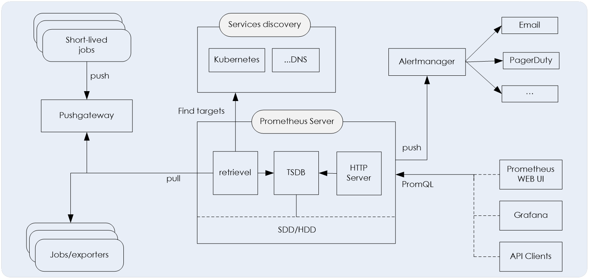
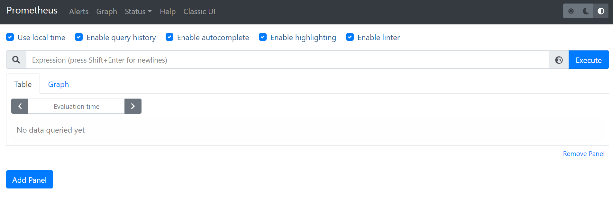
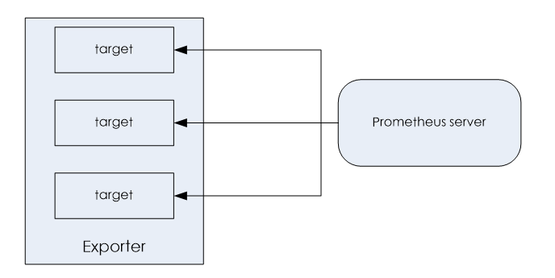
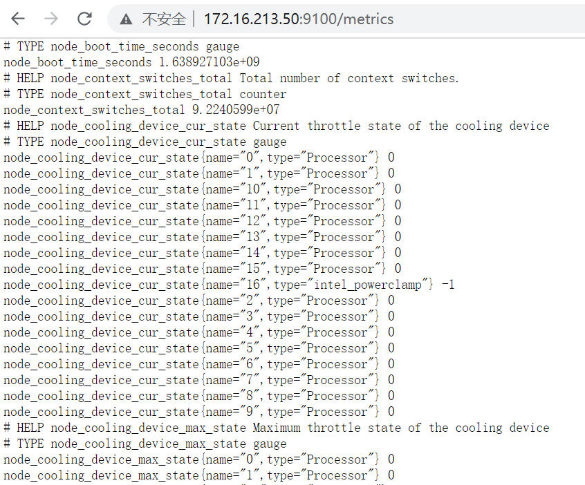
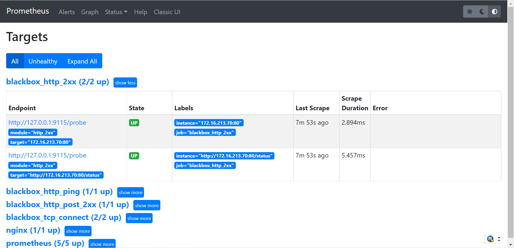

## 一、prometheus基础介绍

### 1、Prometheus简介

Prometheus是一套开源的系统监控报警框架，作为新一代的云原生监控系统，目前已经有上千个贡献者参与到Prometheus的研发工作上，并且超过120+项的第三方集成。

Prometheus非常适合记录纯数字的时间序列，既可以是以主机为中心的监控，也可以是以服务为导向的动态架构。在微服务的世界，它支持多维度的数据集合，查询功能非常强大。

Prometheus用于评估可用性。如果想要100%的精准度，比如每个请求的清单，那么，Prometheus可能不是一个好的选择，因为它收集上来的数据可能没这么细致、完整。

### 2、Prometheus 的组件与架构

Prometheus 的生态系统包括多个组件，大部分的组件都是用Go语言编写的，因此部署非常方便，而这些组件大部分都是可选的，Prometheus的基本架构如下图所示：



对几个主要组件介绍如下：

```xaml
（1）、Prometheus Server
Prometheus Server是Prometheus组件中的核心部分，负责实现对监控数据的获取，存储以及查询。

（2）、推送网关（push gateway）
主要是用来接收由Client push过来的指标数据，在指定的时间间隔，由Prometheus Server来抓取。

（3）、Exporter
主要用来采集数据，并通过HTTP服务的形式暴露给Prometheus Server，Prometheus Server通过访问该Exporter提供的接口，即可获取到需要采集的监控数据。
常见的Exporter有很多，例如node_exporter、mysqld_exporter、statsd_exporter、blackbox_exporter、haproxy_exporter等等，支持如 HAProxy，StatsD，Graphite，Redis 此类的服务监控。

（4）、告警管理器（Alertmanager）
管理告警，主要是负责实现监控报警功能。在Prometheus Server中支持基于PromQL创建告警规则，如果满足PromQL定义的规则，则会产生一条告警，而告警的后续处理流程则由AlertManager进行管理。
```

从架构图中可以看出其大概的工作流程：

```xquery
（1）、Prometheus Server 以服务发现（如 Kubernetes、DNS等）的方式自动发现或者静态配置添加监控目标。
（2）、Prometheus Server 定期从监控目标（Jobs/exporters）或 Pushgateway 中拉取数据（metrics），将时间序列数据保存到其自身的时间序列数据库（TSDB）中。
（3）、Prometheus Server 通过 HTTP Server 对外开放接口，可通过可视化工具（如 Prometheus web UI、Grafana 或自己开发的工具）以PromQL查询/导出数据。
（4）、当有告警产生时，Prometheus Server 将告警信息推送到Alertmanager ，由 Alertmanager 根据配置的告警策略发送告警信息到对应的接收端。
（5）、Pushgateway 接收 “Short-lived” 类型的 Jobs 推送过来的metrics并缓存，等待 Prometheus Server来抓取。
```

### 3、Prometheus数据模型

promethes监控中对于采集过来的数据统称为metrics数据，当我们需要为某个系统、某个服务做监控统计时，就需要用到Metrics数据。因此，metric是对采样数据的总称，注意，metrics并不代表某种具体的数据格式，它是对于度量计算单位的抽象。

Prometheus中存储的数据为时间序列T-S（time-series），是由 metric 的名字和一系列的标签（key/value键值对）来唯一标识的，不同的标签代表不同的时间序列。格式如下：

```less
<metric name>{<label name>=<label value>, …}
```

- metric名字：该名字表示一个可以度量的指标，名字需要有表达的含义，一般用于表示 metric 的功能，例如prometheus_http_requests_total， 表示http请求的总数。其中，metric 名字由 ASCII 字符，数字，下划线，以及冒号组成。

- 标签：标签可以使 Prometheus的数据更加丰富，能够区分具体不同的实例。例如： 

  `prometheus_http_requests_total{code="200"}`

  表示所有http请求中状态码为200的请求。当code="403"时，就变成一个新的metric。标签中的键由ASCII字符，数字，以及下划线组成。

时间序列的样本数据包括一个float64的值和一个毫秒级的unix时间戳，这些数据是按照某个时序以时间维度采集的数据。

### 4、Prometheus的常见数据类型

Prometheus 客户端库主要提供四种主要的数据类型，分别为：

**（1）、Counter**

这是一种累加的metric，典型的应用如：请求的个数，结束的任务数， 出现的错误次数等等。可以把Counter理解为计数器，数据量从0开始累积计算，在理想状态下数值只能是永远的增加，不会降低。

例如，查询http_requests_total{method="get", job="Prometheus", handler="query"}返回988，过5秒钟后，再次查询，则返回结果为1020，总之返回的数值一定是前面大于后面。

**（2）、Gauge**

一种常规的metric，典型的应用如：温度，运行的任务的个数。可以任意加减。

例如：go_goroutines{instance="172.16.213.2", job="Prometheus"}，返回值 189，10 秒后返回 133。又例如：如果我要监控硬盘容量或者内存的使用量，那么就应该使用Gauges的metrics格式来度量，因为硬盘的容量或者内存的使用量是随着时间的推移不断的瞬时且没有规则变化的，这种变化没有规律，当前是多少，采集回来的就是多少，可以是增加，也可以是降低，这种就是Gauges使用类型的代表。

**（3）、Histogram**

Histogram用来统计数据的分布情况。例如最大值，最小值，中间值，还有中位数等，这是一种特殊的metrics数据类型， 代表的是一种近似的百分比估算数值。

**（4）、Summary**

类似于Histogram, 典型的应用如：请求持续时间，响应大小。提供监测值的“count”和“sum”功能。提供百分位的功能，即可以按百分比划分跟踪结果。

## 二、Prometheus 安装和配置

安装Prometheus之前必须要先安装ntp时间同步，因为prometheus server对系统时间的准确性要求很高，必须保证本机时间实时同步。这里我们以Centos7为例，先执行时间同步，执行如下计划任务：

```less
[root@localhost ~]# timedatectl set-timezone Asia/Shanghai
[root@localhost ~]# contab -e
* * * * * ntpdate -u cn.pool.ntp.org
```

### 1、 Prometheus server下载

首先需要到Prometheus官网 http://prometheus.io 下载最新版本的Prometheus，这里我们下载的是prometheus-2.31.1.linux-amd64.tar.gz。

### 2、 安装与启动Prometheus server

prometheus的安装非常简单，只需解压即可，然后执行命令可直接启动。

```
[root@localhost ~]# tar -xvzf prometheus-2.31.1.linux-amd64.tar.gz
[root@localhost ~]# mv prometheus-2.31.1.linux-amd64  /usr/local/prometheus
[root@localhost ~]# cd /usr/local/prometheus
[root@localhost prometheus]# nohup ./prometheus &
```

启动后，Prometheus UI默认运行在9090端口。浏览器可以直接打开访问，无账号密码验证，如下图所示：



Prometheus UI是Prometheus内置的一个可视化管理界面，通过Prometheus UI，用户能够轻松的了解Prometheus当前的配置，监控任务运行状态等。 通过Graph面板，用户还能直接使用PromQL实时查询监控数据。

Promtheus作为一个时间序列数据库，其采集的数据会以文件的形似存储在本地中，默认的存储路径为执行命令的当前data目录下，会自动创建，用户也可以通过参数--storage.tsdb.path="data/"修改本地数据存储的路径。

### 3、Prometheus server配置文件介绍

Prometheus的主配置文件prometheus.yml，其实prometheus解压安装之后，就默认自带了一个基本的配置文件，简单修改后的prometheus.yml文件内容如下：

```yaml
# my global config
global:
  scrape_interval: 15s # Set the scrape interval to every 15 seconds. Default is every 1 minute.
  evaluation_interval: 15s # Evaluate rules every 15 seconds. The default is every 1 minute.
  # scrape_timeout is set to the global default (10s).

# Alertmanager configuration
alerting:
  alertmanagers:
    - static_configs:
        - targets:
          - 127.0.0.1:9093

# Load rules once and periodically evaluate them according to the global 'evaluation_interval'.
rule_files:
  #- "first_rules.yml"
  #- "second_rules.yml"

# A scrape configuration containing exactly one endpoint to scrape:
# Here it's Prometheus itself.
scrape_configs:
  # The job name is added as a label `job=<job_name>` to any timeseries scraped from this config.
  - job_name: "prometheus"
    # metrics_path defaults to '/metrics'
    # scheme defaults to 'http'.

    static_configs:
      - targets: ["localhost:9090",'172.16.213.50:9100','172.16.213.186:9100','172.16.213.233:9104','172.
16.213.186:9121']
```

对重要参加介绍如下：

（1）、global是一些常规的全局配置，这里只列出了两个参数，含义如下：

```
scrape_interval:   15s   #每15s采集一次数据
evaluation_interval: 15s   #每15s做一次告警检测
```

（2）、rule_files指定加载的告警规则文件，告警规则放到下面来介绍。

（3）、scrape_configs指定prometheus要监控的目标，这部分是最复杂的。在scrape_config中每个监控目标是一个job，但job的类型有很多种。可以是最简单的static_config，即静态地指定每一个目标，例如上面的：

```yaml
- job_name: prometheus
static_configs:
 - targets: ['localhost:9090']
```

这里定义了一个job的名称：job_name: 'prometheus'，然后开始定义监控节点，这里指定的是prometheus本机的一个监控节点，对应的9090端口，可以继续扩展加入其它需要被监控的节点，例如：

```yaml
- job_name: 'aliyun'
static_configs:
  -  targets:[‘server1:9100’,'IP:9100’,’nginxserver:9100','web01:9100’,'redis:9100','logserver:9100','redis2:9100']
```

可以看到targets可以并列写入多个节点，用逗号隔开，机器名+端口号，端口号主要是exporters的端口，在这里9100其实是node_exporter的默认端口。

配置完成后，prometheus就可以通过配置文件识别监控的节点，持续开始采集数据，prometheus基础配置也就搭建好了。

## 三、prometheus监控Linux主机状态

### 1、Exporter介绍

所有可以向Prometheus提供监控样本数据的程序都可以被称为一个Exporter。而Exporter的一个实例称为target，如下图所示，Prometheus通过轮询的方式定期从这些target中获取样本数据：



从Exporter的来源上来讲，主要分为两类：分别是社区提供的和用户自定义的，分别介绍如下：

**（1）、社区提供的**

Prometheus社区提供了丰富的Exporter的实现，涵盖了从基础设施，中间件以及网络等各个方面的监控功能。这些Exporter可以实现大部分通用的监控需求。下面列举一些社区中常用的Exporter，如下表所示：

下表是Prometheus常见的Exporter实现

| 分类     | Exporter名称                                             |
| -------- | -------------------------------------------------------- |
| 硬件     | Node Exporter、IPMI Exporter、IoT Edison Exporter        |
| 存储     | HDFS Exporter、Ceph Exporter                             |
| HTTP服务 | HAProxy Exporter、Nginx Exporter、Apache Exporter        |
| 日志     | Fluentd Exporter、Grok Exporter                          |
| 监控系统 | Nagios Exporter、SNMP Exporter、Graphite Exporter        |
| 消息队列 | Kafka Exporter, NSQ Exporter, RabbitMQ  Exporter         |
| API服务  | GitHub Exporter、Docker Cloud Exporter、AWS ECS Exporter |

**（2）、用户自定义的**

我们除了可以直接使用社区提供的Exporter以外，还可以基于Prometheus提供的Client Library创建适合自己的Exporter程序，目前Promthues社区官方提供了对以下编程语言的支持：Python 、Go、Java/Scala、Ruby等。同时还有第三方实现的如：Bash、C++、Lua、Node.js、PHP、Rust等。

官方推荐的Exporter列表：https://prometheus.io/docs/instrumenting/exporters/

### 2、Node exporte介绍

Node exporte主要用于采集被监控主机上的cpu负载，内存的使用情况，网络等数据，并上报数据给Prometheus server。Node_exporter 其实是一个以http_server方式运行在后台，并且持续不断采集 Linux系统中各种操作系统本身相关的监控参数的程序，其采集量是很快很全的，默认的采集项目就远超过了我们的实际需求。

从Prometheus官网https://prometheus.io/download/ 下载node_exporter，这里我们下载的版本是node_exporter-1.3.1.linux-amd64.tar.gz ，下载之后解压缩然后直接运行即可。

node_exporter的安装、运行非常简单，过程如下所示：

```less
[root@localhost ~]# tar zxvf node_exporter-1.3.1.linux-amd64.tar.gz
[root@localhost ~]# mv node_exporter-1.3.1.linux-amd64  /usr/local/node_exporter
[root@localhost ~]# cd  /usr/local/node_exporter
[root@localhost node_exporter]# nohup ./node_exporter &
```

运行起来以后 我们使用“netstats -tnlp”命令可以来看下 node_exporter进程的状态，node_exporter默认监听在9100端口，要关闭被监控机上的防火墙、selinux等，确保node_exporter可以响应 prometheus_server发过来的HTTP_GET请求，也可以响应其他方式的HTTP_GET请求，最简单的方式，在浏览器打开：http://“node_exporter所在服务器的IP地址”:9100/metrics ， 看是否有初始Node Exporter监控指标生成。如下图所示：



可以看出，exporter返回的数据格式如下：

```yacas
# HELP node_cpu_seconds_total Seconds the CPUs spent in each mode.
# TYPE node_cpu_seconds_total counter
node_cpu_seconds_total{cpu="4",mode="idle"} 199147.19
# HELP node_load1 1m load average.
# TYPE node_load1 gauge
node_load1 0
# HELP node_load15 15m load average.
# TYPE node_load15 gauge
node_load15 0.05
# HELP node_load5 5m load average.
# TYPE node_load5 gauge
node_load5 0.01
```

其中，HELP用于解释当前指标的含义，TYPE则说明当前指标的数据类型。在上面的例子中node_cpu_seconds_total的注释表明当前指标是cpu4上idle进程占用CPU的总时间，CPU占用时间是一个只增不减的度量指标，从类型中也可以看出node_cpu_seconds_total的数据类型是计数器(counter)，与该指标的实际含义一致。又例如node_load1该指标反映了当前主机在最近一分钟以内的负载情况，系统的负载情况会随系统资源的使用而变化，因此node_load1反映的是当前状态，数据可能增加也可能减少，从注释中可以看出当前指标类型为仪表盘(gauge)，与指标反映的实际含义一致。

除了这些以外，在当前页面中根据物理主机系统的不同，还可能看到如下监控指标：

-  node_boot_time：系统启动时间
-  node_cpu：系统CPU使用量
-  node_disk ：磁盘IO
-  node_filesystem ：文件系统用量
-  node_load1：系统负载
-  node_memory ：内存使用量
-  node_network ：网络带宽
-  nodetime：当前系统时间
-  go：node exporter中go相关指标
-  process_：node exporter自身进程相关运行指标


## 四、prometheus监控mysq数据库


### 1、部署数据库

这里采用二进制方式部署mysql5.7版本，mysql8.0版本部署方式完全相同。

```less
[root@mysqlserver ~]# cd /usr/local/
[root@mysqlserver  local]# tar zxvf mysql-5.7.35-linux-glibc2.12-x86_64.tar.gz
[root@mysqlserver  local]# mv mysql-5.7.35-linux-glibc2.12-x86_64  mysql
[root@mysqlserver  local]# mkdir /usr/local/mysql/data
[root@mysqlserver  local]# mkdir /usr/local/mysql/etc
[root@mysqlserver  local]# mkdir /usr/local/mysql/logs
[root@mysqlserver  local]# useradd mysql
[root@mysqlserver ~]# vim /usr/local/mysql/etc/my.cnf
[mysqld]
datadir=/usr/local/mysql/data
socket=/tmp/mysql.sock
log-error=/usr/local/mysql/logs/mysqld.log
pid-file=/usr/local/mysql/logs/mysqld.pid
[root@mysqlserver ~]# chown -R mysql:mysql  /usr/local/mysql
[root@mysqlserver ~]# cd /usr/local/mysql
[root@mysqlserver mysql]# bin/mysqld --initialize --user=mysql --basedir=/usr/local/mysql --datadir=/usr/local/mysql/data
[root@mysqlserver mysql]# cp /usr/local/mysql/support-files/mysql.server /etc/init.d/mysqld
[root@mysqlserver mysql]# rm -rf /etc/my.cnf
[root@mysqlserver mysql]# chkconfig --level 35 mysqld on
[root@mysqlserver mysql]# /etc/init.d/mysqld start
```

Mysql启动成功后，需要重置root密码，临时密码在上面定义的mysql日志文件/usr/local/mysql/logs/mysqld.log中可以查到，找到临时密码后，进入mysql命令行，执行如下sql

```less
[root@mysqlserver ~]# /usr/local/mysql/bin/mysql -uroot -p
输入临时密码
进入sql命令行后，执行如下命令，修改root密码：
SQL> alter user 'root'@'localhost' identified by 'root@mySQL123';
到这里为止，mysql服务部署完成。
```

至此，mysql部署完成。

### 2、在数据库上创建用户

紧接着上面的不做，在数据库上创建一个监控用户，并做授权：

```mysql
SQL> CREATE USER 'mysqld_exporter'@'localhost' IDENTIFIED BY 'mysqld123456' WITH MAX_USER_CONNECTIONS 3;
SQL> GRANT PROCESS, REPLICATION CLIENT, SELECT ON *.* TO 'mysqld_exporter'@'localhost';
```

注意：在创建用户的时候，推荐执行 MAX_USER_CONNECTIONS参数，避免我们监控使用过多的数据库连接数，导致数据库压力过大。

### 3、部署mysqld_exporter监控程序

下载mysqld_exporter监控程序，然后将mysqld_exporter放到/usr/local目录下，执行如下操作：

```less
[root@xenon1 local]# mkdir /usr/local/prometheus
[root@xenon1 local]# tar zxvf mysqld_exporter-0.13.0.linux-amd64.tar.gz -C /usr/local/prometheus
[root@xenon1 local]# cd /usr/local/prometheus
[root@xenon1 prometheus]# mv mysqld_exporter-0.13.0.linux-amd64  mysqld_exporter
[root@xenon1 prometheus]# chown -R mysql:mysql /usr/local/prometheus/mysqld_exporter
```

### 4、编写启动mysqld_exporter服务脚本

用于启动mysqld_exporter的脚本内容如下：

```less
[root@xenon1 local]# vim /usr/lib/systemd/system/mysqld_exporter.service
[Unit]
Description=mysqld_exporter
After=network.target
[Service]
Type=simple
User=mysql
Environment=DATA_SOURCE_NAME=mysqld_exporter:mysqld123456@(localhost:3306)/
ExecStart=/usr/local/prometheus/mysqld_exporter/mysqld_exporter --web.listen-address=0.0.0.0:9104 
  --config.my-cnf /etc/my.cnf \
  --collect.slave_status \
  --collect.slave_hosts \
  --log.level=error \
  --collect.info_schema.processlist \
  --collect.info_schema.innodb_metrics \
  --collect.info_schema.innodb_tablespaces \
  --collect.info_schema.innodb_cmp \
  --collect.info_schema.innodb_cmpmem 
Restart=on-failure
[Install]
WantedBy=multi-user.targe
```

几个重要参数，含义如下：

- --config.config.my-cnf	指定配置文件的路径
- --web.listen-address	指定监听的地址，端口
- --log.level	指定日志级别
- Environment：指定mysqld_exporter访问mysql库的用户名和密码，这些已经在mysql库中做过添加了。

最好，启动mysqld_exporter服务即可：

```less
[root@localhost ~]# systemctl daemon-reload
[root@localhost ~]# systemctl start mysqld_exporter
```

mysqld_exporter服务启动之后，就可以通过http://ip:9104/metrics 访问到mysqld_exporter收集到的mysql状态数据。

## 五、prometheus监控redis数据库


### 1、部署redis数据库


### 2、获取并部署redis_exporter

redis_exporter并不是prometheus官方提供的，但官方推荐了第三方开发的exporter，搭建可以从https://github.com/oliver006/redis_exporter获取redis_exporter。

从这个地址下载最新版本的redis_exporter，由于安装包是二进制形式的，所以下载后，解压即可使用。

```less
[root@redis ~]#  tar zxvf redis_exporter-v1.32.0.linux-amd64.tar.gz -C /usr/local
[root@redis ~]#  cd /usr/local
[root@redis local]#  mv redis_exporter-v1.32.0.linux-amd64  redis_exporter
```

这里将redis_exporter放到了/usr/local/redis_exporter目录下。

### 3、启动redis_exporter

执行如下命令，即可启动redis_exporter：

```less
[root@redis data]# nohup /usr/local/redis_exporter/redis_exporter -redis.addr 127.0.0.1:6379 -web.listen-address :9121 &
```

几个参数含义如下：

- -redis.addr: 指定redis服务的ip地址和端口号
- -web.listen-address: 指定当前redis-exporter启动使用的端口信息
- -redis.password： redis服务若是有密码的话，可用此参数指定redis的密码

可以将启动redis_exporter的服务写个脚本，内容如下：

```less
[root@xenon1 local]# vim /usr/lib/systemd/system/redis_exporter.service
[Unit]
Description=redis_exporter
After=network.target
[Service]
Type=simple
User=prometheus
ExecStart=/usr/local/redis_exporter/redis_exporter -redis.addr 127.0.0.1:6379 -web.listen-address :9121
Restart=on-failure
[Install]
WantedBy=multi-user.target
```

最后，重启redis_exporter服务即可：

```less
[root@localhost ~]# systemctl daemon-reload
[root@localhost ~]# systemctl start redis_exporter
```

redis_exporter服务启动之后，就可以通过http://ip:9121/metrics 访问到redis_exporter收集到的redis状态数据。

## 六、prometheus监控nginx

官方提供了两种收集 Nginx 指标的方式。第一种是 Nginx metric library，这是一段Lua脚本（prometheus.lua），Nginx需要开启Lua支持（libnginx-mod-http-lua 模块）。为方便起见，也可以使用 OpenResty的OPM（OpenResty Package Manager）来安装。

第二种是 Nginx VTS exporter，这种方式比第一种要强大的多，安装要更简单，支持的指标也更丰富，它依赖于nginx-module-vts模块，vts模块可以提供大量的 Nginx 指标数据，可以通过 JSON、HTML 等形式查看这些指标。Nginx VTS exporter 就是通过抓取 /status/format/json 接口来将 vts 的数据格式转换为 Prometheus 的格式。不过，在 nginx-module-vts 最新的版本中增加了一个新接口：/status/format/prometheus，这个接口可以直接返回 Prometheus 的格式，从这点这也能看出 Prometheus的影响力，目前Nginx VTS exporter基本退役了，所以我们只需安装此模块即可。无需安装基于nginx的exporter。

这里假定要监控的nginx服务器IP地址为172.16.213.70，后面会用到这个IP地址。

### 1、安装nginx以及nginx-module-vts模块

nginx必须安装nginx-module-vts模块支持，它提供对虚拟主机状态信息的访问，它包含当前状态，如服务器、upstreams、缓存等，此模块自带了prometheus可读取的数据格式，因此，只需安装此模块，无需另外的nginx的exporter。

Nginx下载地址：http://nginx.org/download/

nginx-module-vts下载地址：https://github.com/vozlt/nginx-module-vts

#安装依赖软件

```less
[root@localhost ~]# yum -y install gcc-c++ pcre pcre-devel zlib zlib-devel openssl openssl-devel
```

#git安装nginx-module-vts

```less
[root@localhost local]# git clone git://github.com/vozlt/nginx-module-vts.git
[root@localhost opt]# cp -r nginx-module-vts-master /usr/local/nginx-module-vts
```

#开始编译安装nginx

```less
[root@localhost opt]# tar -zxvf nginx-1.20.2.tar.gz
[root@localhost opt]# cd nginx-1.20.2
[root@localhost nginx-1.20.2]# ./configure --prefix=/usr/local/nginx --add-module=/usr/local/nginx-module-vts/
[root@localhost nginx-1.20.2]# make && make install
```

### 2、配置nginx

nginx安装完成后，要在nginx配置文件中，添加几个参数和配置，主要内容如下：

[root@localhost nginx-1.20.2]# vi /usr/local/nginx/conf/nginx.conf

```less
http {
    vhost_traffic_status_zone;

    ...
    
    server {
    
        ...
    
        location /status {
            vhost_traffic_status_display;
            vhost_traffic_status_display_format html;
        }
    }
}
```

配置文件修改完成，重启nginx服务，配置生效。

```less
[root@localhost nginx-1.20.2]# /usr/local/nginx/sbin/nginx
```

nginx重启后，可访问http://172.16.213.70/status 即可看到nginx监控状态信息，如下图所示：


也可以访问http://172.16.213.70/status/format/prometheus，获取prometheus可读取的格式数据，如下图所示：


这就是prometheus可读取的格式数据。

### 3、与prometheus集成

修改prometheus配置，添加如下内容：

```less
[root@localhost ~]# vi /usr/local/prometheus/prometheus.yml
#添加一个job
  - job_name: "nginx"
    metrics_path: /status/format/prometheus
    static_configs:
      - targets: ["172.16.213.70"]
```

配置文件修改完成，重启prometheus使配置生效即可。

```less
[root@localhost ~]# systemctl restart prometheus
```

4、测试

prometheus重启后，即可获取到nginx的状态数据，如下图所示：


上图中几个状态的含义如下：

- accepts：接收到的客户端发来的连接数
- Active ：当前的活动连接数，包含处于等待状态的连接。
- handled：已经处理完成的连接数，一般情况下它的accepts值相同，如果不同说明nginx性能出现瓶颈。
- reading：正在读取请求头信息的连接数
- requests：客户端请求总数
- waiting：处于闲置状态正等待客户端发送请求的连接数
- writing：正在发送相应报文的连接数

## 七、prometheus的黑盒监控

有些时候，我们想监听服务器的某个端口是否存在，监听http的请求是否正确时，这个时候就可以使用blackbox_exporter来实现。blackbox_exporter是Prometheus 官方提供的 exporter 之一，可以提供 http、dns、tcp、icmp 的监控数据采集。

blackbox_exporter 应用场景主要有如下几个：

- **HTTP 测试**
      定义 Request Header 信息
      判断 Http status / Http Respones Header / Http Body 内容

- **TCP 测试**
      业务组件端口状态监听
       应用层协议定义与监听

- **ICMP 测试**
      主机探活机制

- **POST 测试**
      接口联通性

- **SSL 证书过期时间**

### 1、blackbox_exporter的安装部署

从https://prometheus.io/download/ 下载最新版本，我这里下载的是blackbox_exporter-0.19.0.linux-amd64.tar.gz
然后将压缩包上传到服务器。执行如下操作：

```less
[root@localhost ~]# cd /data
[root@localhost data]# tar -zxvf blackbox_exporter-0.19.0.linux-amd64.tar.gz
[root@localhost data]# mv blackbox_exporter-0.19.0.linux-amd64 blackbox_exporter
[root@localhost data]# cd blackbox_exporter
[root@localhost blackbox_exporter]#ls
blackbox_exporter  blackbox.yml  LICENSE  NOTICE
```

此目录下，默认有一个配置文件blackbox.yml，无需修改，直接使用即可。简单介绍下此文件的内容含义：

```yaml
[root@localhost blackbox_exporter]# cat blackbox.yml 
modules:
  http_2xx: # 这个名字是定义模块名称，可随便写，但是需要在prometheus.yml配置文件中对应起来。保持默认即可
    prober: http # 进行探测的协议，可以是 http、tcp、dns、icmp等
    timeout: 10s
  http_post_2xx:
    prober: http
    http:
      method: POST
  tcp_connect: # tcp检测，比如检测某个端口是否在线
    prober: tcp
  icmp: # icmp 检测，比如ping某个服务器
    prober: icmp
    ......
```

### 2、添加blackbox_exporter为系统服务

创建/usr/lib/systemd/system/blackbox_exporter.service文件，内容如下：

```less
[root@localhost ~]# vi /usr/lib/systemd/system/blackbox_exporter.service
[Unit]
Description=blackbox_exporter
After=network.target
[Service]
Type=simple
User=root
Group=root
ExecStart=/data/blackbox_exporter/blackbox_exporter \
    --config.file=/data/blackbox_exporter/blackbox.yml \
    --web.listen-address=:9115
Restart=on-failure
[Install]
WantedBy=multi-user.target
```

最后，启动 blackbox_exporter服务：执行如下命令：

```less
[root@localhost ~]# systemctl daemon-reload
[root@localhost ~]# systemctl restart blackbox_exporter
```

至此，blackbox_exporter服务配置完成。

### 3、在prometheus中添加Blackbox相关监控

同理，需要修改prometheus.yml文件，添加如下内容：

```yaml
#下面这个是配置get请求检测
- job_name: 'blackbox_http_2xx'
    scrape_interval: 30s
    metrics_path: /probe
    params:
    #这里的http_2xx要跟blackbox.yml文件中的定义对应起来。
      module: [http_2xx]
    static_configs:
    #下面这个targets是通过http get请求的地址，可以写多个，探讨是否正常
      - targets:
        - 172.16.213.70:80
        - http://172.16.213.70:80/status
    relabel_configs:
      - source_labels: [__address__]
        target_label: __param_target
      - source_labels: [__param_target]
        target_label: instance
      - target_label: __address__
      #这里的replacement是指定访问blackbox-exporter服务所在的机器和端口
        replacement: 127.0.0.1:9115
  - job_name: 'blackbox_http_post_2xx'
    scrape_interval: 30s
    metrics_path: /probe
    params:
    #这里定义通过http post方式探测
      module: [http_post_2xx]
    static_configs:
    #这里定义通过http post方式探测的地址和端口
      - targets:
        - 172.16.213.103:8048
    relabel_configs:
      - source_labels: [__address__]
        target_label: __param_target
      - source_labels: [__param_target]
        target_label: instance
      - target_label: __address__
      #这里的replacement是指定访问blackbox-exporter服务所在的机器和端口
        replacement: 127.0.0.1:9115
  - job_name: 'blackbox_http_ping'
    scrape_interval: 30s
    metrics_path: /probe
    params:
    #这里是定义通过imcp方式进行探测
      module: [icmp]
    static_configs:
    #这里定义通过icmp方式探测的地址
      - targets:
        - 171.84.4.1
    relabel_configs:
      - source_labels: [__address__]
        target_label: __param_target
      - source_labels: [__param_target]
        target_label: instance
      - target_label: __address__
        replacement: 127.0.0.1:9115
  - job_name: 'blackbox_tcp_connect'
    scrape_interval: 30s
    metrics_path: /probe
    params:
    #这里定义通过tcp方式进行服务或端口的探测
      module: [tcp_connect]
    static_configs:
    #这里定义通过tcp进行探测的服务和端口
      - targets:
        - 172.16.213.146:80
        - 172.16.213.103:8048
    relabel_configs:
      - source_labels: [__address__]
        target_label: __param_target
      - source_labels: [__param_target]
        target_label: instance
      - target_label: __address__
        replacement: 127.0.0.1:9115
```

配置文件修改完成，重启prometheus使配置生效即可。

```less
[root@localhost ~]# systemctl restart prometheus
```

最后，在prometheus的ui上可以看到配置成功的targets，如下图所示：



## 八、基于Altermanager的告警机制


## 九、PromQL表达式


## 十、Pushgateway


## 十一、Grafana可视化

